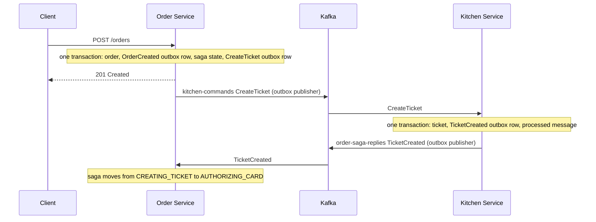

# ftgo-app

A modernized implementation of the FTGO (Food To Go) application from the book
[Microservices Patterns](https://microservices.io/book) by Chris Richardson,
built chapter by chapter as a learning project.

The book's original code lives in
[microservices-patterns/ftgo-application](https://github.com/microservices-patterns/ftgo-application).
This repository rebuilds the same application with a more current stack and hand-written
infrastructure instead of the book's own library, so every pattern is visible in the code.

## What differs from the book's code

| Book's reference app | This project |
|---|---|
| Eventuate Tram (messaging, outbox, sagas) | Hand-written transactional outbox + Apache Kafka |
| Older Java and Spring Boot | Java 21, Spring Boot 3.5, records for DTOs and messages |
| MySQL | PostgreSQL 16, one schema per service |
| Schema managed by the app | Flyway migrations, Hibernate runs with `ddl-auto: validate` |

## Stack

Java 21, Spring Boot 3.5, Gradle multi-module, PostgreSQL 16, Apache Kafka (KRaft, no ZooKeeper),
Flyway, Docker Compose.

## Architecture

| Module | Port | Status |
|---|---|---|
| `ftgo-common` | - | shared library: transactional outbox |
| `ftgo-consumer-service` | 8081 | `POST /consumers`, publishes `ConsumerCreated` |
| `ftgo-order-service` | 8082 | `POST /orders`, saga orchestrator (in progress) |
| `ftgo-kitchen-service` | 8083 | saga participant: handles `CreateTicket` |
| `ftgo-accounting-service` | - | skeleton only |
| `ftgo-delivery-service` | - | skeleton only |
| `ftgo-restaurant-service` | - | skeleton only |

Each service owns its data: a separate PostgreSQL schema (`consumer_service`, `order_service`,
`kitchen_service`) and its own `outbox_events` table.

### Kafka topics

| Topic | Message | From | To |
|---|---|---|---|
| `consumer-events` | `ConsumerCreated` | Consumer Service | nobody yet |
| `order-events` | `OrderCreated` | Order Service | nobody yet |
| `kitchen-commands` | `CreateTicket` | Order Service | Kitchen Service |
| `order-saga-replies` | `TicketCreated` | Kitchen Service | Order Service |

### Create Order saga (orchestration, work in progress)



The saga currently stops at `AUTHORIZING_CARD`. The Accounting Service, the approval path and the
compensation path (card rejected) are the next steps.

## Patterns implemented

- **Database per service**: one schema per service in a single PostgreSQL instance.
- **Transactional outbox**: business data and the outgoing message are written in one local
  transaction. A polling publisher (`FOR UPDATE SKIP LOCKED`, every 500 ms) moves rows to Kafka,
  so multiple instances do not publish the same row.
- **Idempotent consumer**: every consumer checks the `eventId` header against `processed_messages`
  and writes its business change in the same transaction, so duplicate deliveries are harmless.
- **Saga (orchestration)**: Order Service keeps the saga state in `create_order_saga_state`,
  sends commands to `<service>-commands` topics and reacts to replies on `order-saga-replies`.

## Getting started

Requirements: Java 21, Docker with Compose.

Start PostgreSQL, Kafka and Kafka UI:

```bash
docker compose up -d
```

Run the services, each in its own terminal (Flyway creates the schemas and tables on startup):

```bash
./gradlew :ftgo-consumer-service:bootRun
./gradlew :ftgo-order-service:bootRun
./gradlew :ftgo-kitchen-service:bootRun
```

Try it:

```bash
curl -i -X POST localhost:8081/consumers -H 'Content-Type: application/json' \
  -d '{"firstName":"Ayse","lastName":"Yilmaz"}'

curl -i -X POST localhost:8082/orders -H 'Content-Type: application/json' \
  -d '{"consumerId":1,"restaurantId":5,"totalAmount":59.90}'
```

Then check the result:

- Kafka UI at http://localhost:8090 shows the messages on each topic.
- The saga state and the ticket:

```bash
docker compose exec postgres psql -U ftgo -d ftgo \
  -c "SELECT order_id, state FROM order_service.create_order_saga_state ORDER BY created_at DESC LIMIT 3;"
docker compose exec postgres psql -U ftgo -d ftgo \
  -c "SELECT id, order_id FROM kitchen_service.tickets ORDER BY id DESC LIMIT 3;"
```

The database and Kafka settings are in each service's `application.yml` and are meant for local
development only.

## Tests

```bash
./gradlew build
```

Tests currently run against the local PostgreSQL from `docker compose up -d` (Testcontainers is
not used yet). `KitchenSagaCommandHandlerRollbackTest` proves that if the `processed_messages`
write fails, the ticket and the outbox reply are rolled back together.

## Progress

- [x] Chapter 1: Escaping monolithic hell
- [x] Chapter 2: Decomposition strategies
- [x] Chapter 3: Interprocess communication (transactional outbox, idempotent consumer)
- [ ] Chapter 4: Managing transactions with sagas
    - [x] Saga state and first command (`CreateTicket`)
    - [x] Kitchen command handler and reply loop
    - [ ] Accounting Service (`AuthorizeCard`)
    - [ ] Approval path (`ApproveTicket`, order approved)
    - [ ] Compensation path (card rejected, ticket and order rejected)
- [ ] Chapter 5: Designing business logic (hexagonal architecture, DDD aggregates)
- [ ] Later chapters

## Known limitations

- The saga is incomplete: orders stay in `AUTHORIZING_CARD` and `Order.status` is always `CREATED`.
- The consumer is not verified when an order is created yet.
- `order-events` and `consumer-events` have no consumers.
- No authentication, no API gateway, no service discovery.
- Kafka topics are auto-created, which is only acceptable for local development.